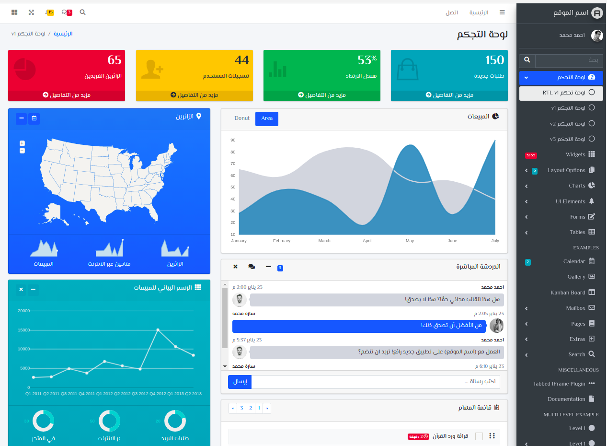

# [AdminLTE RTL - Bootstrap 4 Admin Dashboard](https://adminlte.io)

**AdminLTE** is a fully responsive administration template. Based on **[Bootstrap 4.6](https://getbootstrap.com/)** framework and also the JS/jQuery plugin.
Highly customizable and easy to use. Fits many screen resolutions from small mobile devices to large desktops.

**Preview on [AdminLTE.io](https://adminlte.io/themes/v3)**

## Looking for RTL Templates?

## Documentation

Visit the [online documentation](https://adminlte.io/docs/3.1/) for the most
updated guide. Information will be added on a weekly basis.

## Browsers support

|  IE / Edge |  Firefox |  Chrome |  Safari |  iOS Safari |  Samsung |  Opera |  Vivaldi |  Electron |
| --------- | --------- | --------- | --------- | --------- | --------- | --------- | --------- | --------- |
| IE10, IE11, Edge| last 2 versions| last 2 versions| last 2 versions| last 2 versions| last 2 versions| last 2 versions| last 2 versions| last 2 versions

## Contributing

Please read through our [contributing guidelines](https://github.com/ahmed-fawzy-metwally/AdminLTE-3.1-RTL/tree/master/.github/CONTRIBUTING.md). Included are directions for opening issues, coding standards, and notes on development.

## License

AdminLTE-3.1-RTL is an open source project by [Ahmed Fawzy](https://github.com/ahmed-fawzy-metwally) that is licensed under [MIT](https://opensource.org/licenses/MIT).
AdminLTE.io reserves the right to change the license of future releases.